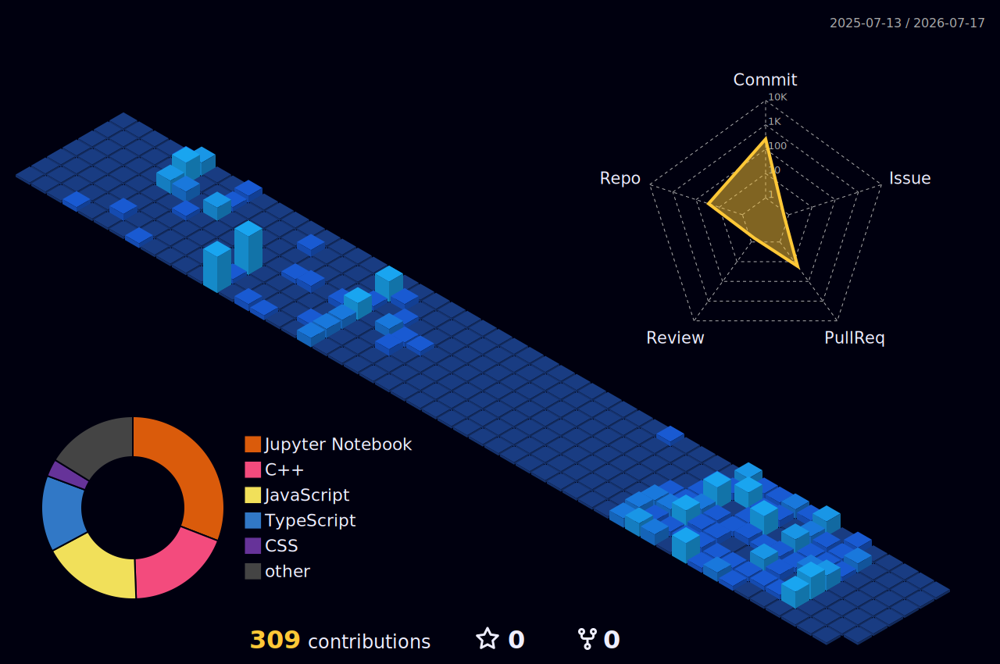
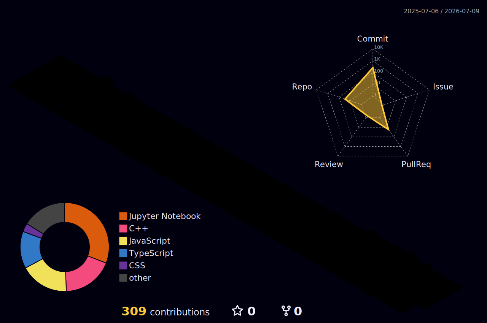

# <picture></picture> Harsh

 

---

<table>
  <tr>
    <td>

<h1>💫 About Me</h1>

- 🎓 B.Tech CSE (Cybersecurity Specialization)
- 🌱 Currently learning **JavaScript, React & DSA**
- 💻 Passionate about **Frontend Development**
- 🔐 Interested in **Cybersecurity & Ethical Hacking**
- 🚀 Building projects and improving daily
- 📫 Reach me at: **harrshdev52@gmail.com**

I am dedicated to growing as a developer, contributing to open-source, and exploring cloud and Cybersecurity to shape the future of the web.

</td>
    <td>
      
    </td>
  </tr>
</table>

---

# 🌐 Connect With Me

---

<h3 align="center">💻 Programming Languages</h3>

  
  
  
  
  

<h3 align="center">🌐 Frameworks & Web Technologies</h3>

  
  
  
  
  
  

<h3 align="center">🤖 AI & Machine Learning</h3>

  
  

<h3 align="center">🗄️ Databases</h3>

  
  
  
  
  

<h3 align="center">🛠️ Tools, Cloud & OS</h3>

  
  
  
  
  
  

---

# 📊 GitHub Stats

---

# 🏆 GitHub Trophies

---

# 📈 Contribution Graph

<h3 align="center">🌐 3D Contribution Graph</h3>

  

  <!-- 
   -->

<h3 align="center">🎖️ Holopin Badges (Hacktoberfest + Open Source)</h3>

  <a href="https://holopin.io/@harsh5ingh#badges">
    
  </a>

---

# 🐍 Snake Eating Contributions

<picture>
  <source media="(prefers-color-scheme: dark)" srcset="https://raw.githubusercontent.com/harsh5ingh/harsh5ingh/output/github-snake-dark.svg">
  <source media="(prefers-color-scheme: light)" srcset="https://raw.githubusercontent.com/harsh5ingh/harsh5ingh/output/github-snake-light.svg">
  
</picture>

---

# ✍️ Dev Quote

---

### 👀 Profile Views

### ⭐ Thanks for visiting my profile!

