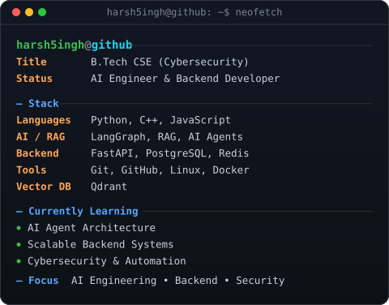

# <picture></picture> Harsh Kumar

 

<table border="1" cellpadding="14" cellspacing="0">
<tr>

<td align="center" valign="middle" width="460">

</td>

<td align="center" valign="middle" width="610">

</td>

</tr>
</table>

<!-- 

 -->

---

# 📊 GitHub Stats

---

<h3 align="center">🎖️ Holopin Badges (Hacktoberfest + Open Source)</h3>

  <a href="https://holopin.io/@harsh5ingh#badges">
    
  </a>

---

# 🐍 Snake Eating Contributions

<picture>
  <source media="(prefers-color-scheme: dark)" srcset="https://raw.githubusercontent.com/harsh5ingh/harsh5ingh/output/github-snake-dark.svg">
  <source media="(prefers-color-scheme: light)" srcset="https://raw.githubusercontent.com/harsh5ingh/harsh5ingh/output/github-snake-light.svg">
  
</picture>

---

<!-- 
# ✍️ Dev Quote

 *

---

### 👀 Profile Views

-->

 
  
### ⭐ Thanks for visiting my profile!

